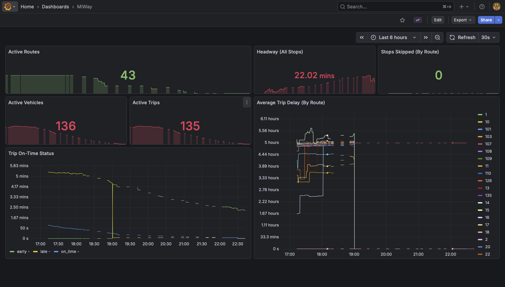

# Public Transit Monitoring

This project monitors public transport operations in real time using GTFS static
and GTFS-realtime data. It exposes operational and service-quality metrics via
Prometheus.

## Usage

Clone the project to your local machine.

```bash
git clone https://github.com/chaunguyenm/transit.git
cd transit
```

Provide the required environment variables in a `.env` file with the following
example format.

```
POSTGRES_USER=
POSTGRES_PASSWORD=
POSTGRES_HOST=db
POSTGRES_PORT=5432
POSTGRES_DB=transit

DEBUG=true
POLL_INTERVAL_SECONDS=15
PROMETHEUS_PORT=9100

GF_SECURITY_ADMIN_USER=
GF_SECURITY_ADMIN_PASSWORD=
GF_USERS_ALLOW_SIGN_UP=false
GF_AUTH_ANONYMOUS_ENABLED=true
GF_AUTH_ANONYMOUS_ORG_NAME="Anonymous Organization"
GF_AUTH_ANONYMOUS_ORG_ROLE="Viewer"
```

Run the Docker containers.

```bash
docker-compose up --build
```

The app will be running at port 9100, Prometheus at port 9090, and Grafana at
port 3000.

To view the provisioned dashboard, navigate to http://localhost:3000 and log in
using the credentials specified in the `.env` file. On the
Grafana Home page, go to Dashboards > MiWay.



## Roadmap

- [x] Export additional service performance metrics
- [x] Add Grafana dashboarding
- [ ] Add support for other city's public transport
    - [ ] Toronto
      ([static](https://open.toronto.ca/dataset/merged-gtfs-ttc-routes-and-schedules/)
      and
      [real-time](https://open.toronto.ca/dataset/ttc-gtfs-realtime-gtfs-rt/))
    - [ ] [Guelph](https://explore.guelph.ca/pages/transit-gtfs-data)
    - [ ] [Brampton](https://geohub.brampton.ca/pages/brampton-transit)
    - [ ] [York](https://www.yrt.ca/en/about-us/open-data.aspx)
    - [ ]
      [Hamilton](https://open.hamilton.ca/documents/SpatialSolutions::hsr-transit-feed/about?path=)

For consideration:
- Reliability scoring based on route, location, timing, etc.
- Predictive delay forecast based on historical data
